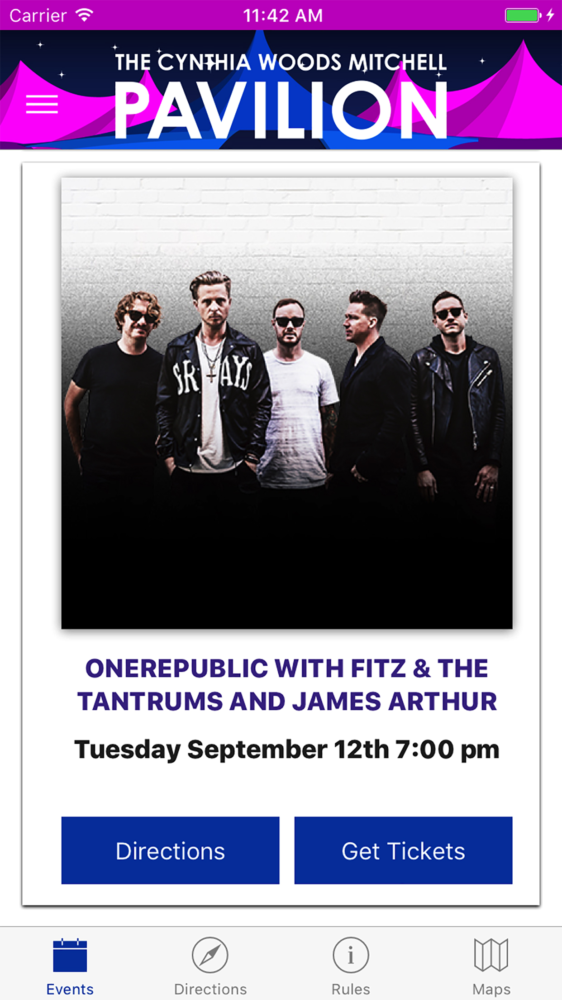
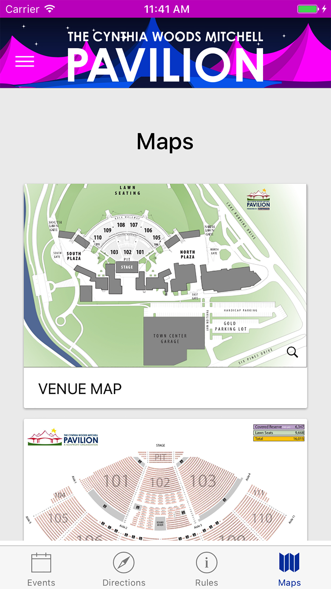

## Woodlands Center Pavilion Application




### With the Ionic CLI:
```bash
	$ sudo npm install
```

### Android

```bash
	$ ionic platform add android
	$ ionic build android --prod
	$ ionic run android --prod
```

### iOS
```bash
	$ ionic platform add ios
	$ ionic build ios --prod
```    
    Run using XCode

### Generate Icons
```bash
	$ ionic resources
```

## TODOS

- open ticket on website
- status bar styles
- card styles
- store events on storage
- push down to refresh
